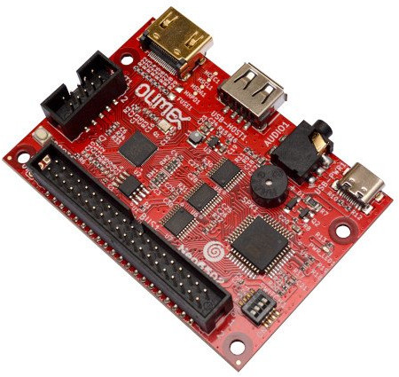

# Welcome to the Olimex Neo6502 Documentation

There is pdf copy of this documentation [here](https://neo6502.com/pdf/document.pdf)

- Real 65C02 Processor clocked at 6.25 Mhz
- "Clean" machine, 64k RAM available
- Low cost purchase, sold for 30 Euros
- All software and hardware is open source
- 320 x 240 256 colour display on HDMI/DVI with a palette
- 32k Graphics RAM for tiles and sprites
- 128 sprites up to 32x32 pixels.
- Multiple tile maps (16x16 tiles, can be double sized)
- High speed drawing features
- Turtle Graphics
- Blitter for high speed graphics
- UEXT interface to access a wide range of hardware add ons.
- 4 channels of square wave or white noise sound
- Predefined set of sound effects.
- Storage USB Key (optionally can use SD Card)
- Fast structured BASIC with hardware support and inline assembler.
- BASIC can be edited on screen, or using a text editor.
- High Speed Integer/Floating point arithmetic
- Documentation, samples, explainers and games, all open source.
- Cross development support
- Accurate cross platform emulator for Windows/Mac/Linux, only requires SDL2
- Serial link to PC for Cross-Development
- Program in PASCAL using Mad Pascal compiler
- Program in 'C' using CC65 and LLVM
- USB Mouse and Gamepad support
- BASIC support for Serial, I2C and SPI hardware via UEXT Connector