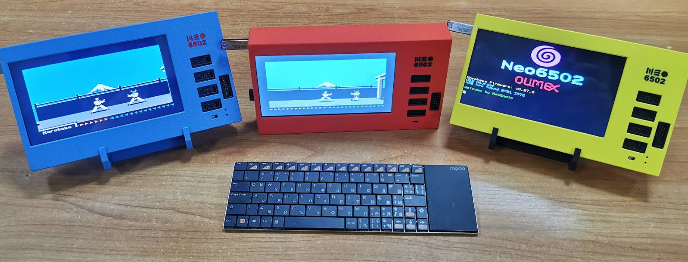

# What is the Olimex Neo6502 ?

This is the Olimex Neo6502 main board. The main components are a 65C02 and a Raspberry Pi Pico. The 65C02 runs the machine code (at about 6.3Mhz) ; the Pico does pretty much everything else.

Most of this document describes its use for a seperate new Retrocomputer design. There are other projects which use the board to emulate real machines ; currently the Apple 2, Oric and Commodore 64 are in development. At the time of writing I do not believe the C64 emulator is publicly released.

There are other models ; early adopters had an A board (this is version B) which is almost identical, but Purple rather than Red, and requires a couple of wires to work properly.

There is also a 'portable' machine which exists in prototype form (at the time of writing) which has an LCD Screen, 4 UEXT sockets and a built in hub.

[What to think about before buying](before.md)

