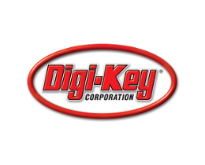

# Where can you buy a Neo6502 ?

*Missing suppliers who wish to be added contact me on Discord*

## Olimex (Europe and worldwide)

The home of the Neo6502 is Plovdiv in Bulgaria, and all the hardware can be bought from Olimex, who deliver worldwide.

## Authorised Resellers

The above resell locally on behalf of Olimex.

### Mouser (Worldwide)

Mouser stock Neo6502s for next day delivery.

### The Pi Hut (UK)

For UK residents the Pi Hut is an option.

### Agon Australia (Australia ... unsurprisingly)

Supporters of the truly *dreadful* Agon Light (note: this is not serious, it's a great piece of hardware) have come to their senses and have started stocking the Neo6502.

### DigiKey (Worldwide)

Digikey stock Neo6502s for next day delivery

[What to do "out of the box"](starting.md)