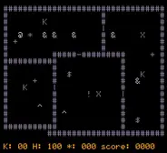
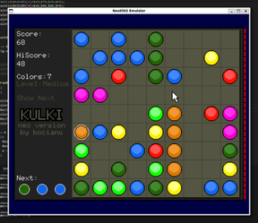
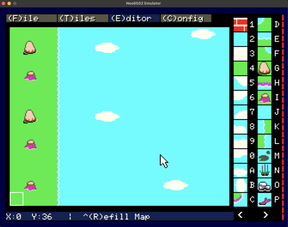
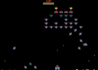
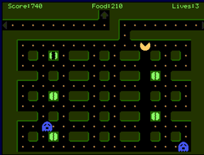
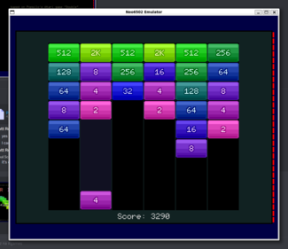
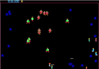
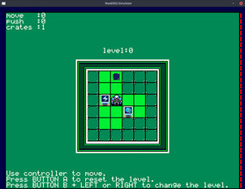
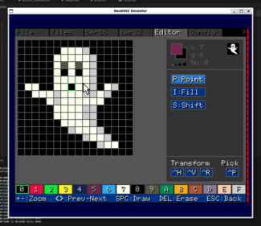

---
---
# Software for the Neo6502

[Dungeon Crawler by Omiq](https://github.com/omiq/neo6502-c/)

[Eliza the Psychiatrist](https://github.com/erlendnagel/Neo6502-Eliza)

[Kulki puzzle game](https://gitlab.com/bocianu/neo-kulki)

[Mad PASCAL Repository by Tomasz Biela](https://github.com/tebe6502/Mad-Pascal)

[Mapper tilemap creator by Giovanni Pozzobon](https://github.com/giovannipozzobon/mapper)

[Neo 6502 BASIC Demo Games repository (Squash, Space Invaders, Galaxians, Frogger, Asteroids)](https://github.com/paulscottrobson/neo6502-games)

[PacMad by Bocianu](https://gitlab.com/bocianu/neo-pacmad)

[Power Bricks game](https://gitlab.com/bocianu/neo-power-bricks)

[Robotron 2084 by Paul Robson](https://github.com/paulscottrobson/neo-robotron)

[Sokoban by zbyti](https://github.com/zbyti/pikoban)

[TaliFORTH repository by Sam Colwell](https://github.com/SamCoVT/TaliForth2/blob/master-64tass/platform/platform-neo6502.asm)

[Tetris by Bocianu](https://gitlab.com/bocianu/neo-tetris)

[Zion Commander File Manager by Bocianu](https://gitlab.com/bocianu/zion-commander)

[Spoon - neo6502 sprite editor by Bocianu](https://gitlab.com/bocianu/neo-spoon)

